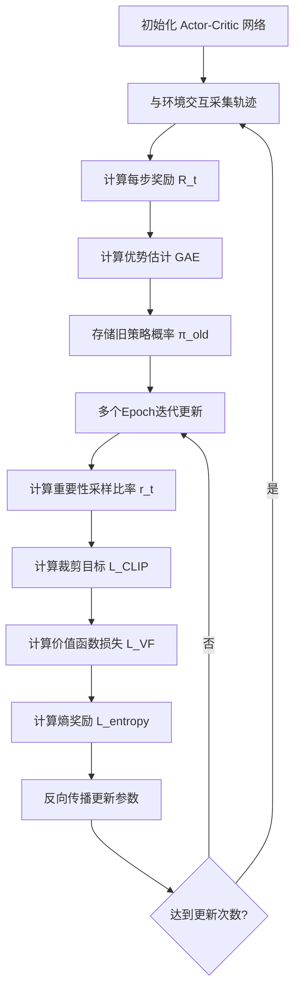

## 前言

最近在研究RLHF（基于人类反馈的强化学习）用于大模型对齐，其核心算法正是PPO。作为当前最主流的策略梯度算法之一，PPO在稳定性和样本效率上取得了很好的平衡，这里记录下PPO的核心思想及其代码实现。

## 正文

`PPO`，Proximal Policy Optimization（近端策略优化），为解决传统策略梯度方法的两个核心问题：

1. **更新步长难以控制**：策略梯度的更新步长过大会导致策略性能急剧下降甚至崩溃，过小则收敛缓慢，而最优步长又难以确定。
2. **样本利用率低**：传统的on-policy方法每次更新后必须丢弃旧数据重新采样，导致样本效率极低。

在此背景下，`TRPO`（Trust Region Policy Optimization）首先提出通过KL散度约束来限制策略更新幅度，但其需要计算二阶导数和共轭梯度，实现复杂且计算开销大。

`PPO` 则另辟蹊径，通过**裁剪（Clipping）机制**巧妙地将策略更新限制在一个"信任区域"内，既保证了训练稳定性，又大幅简化了实现。其核心思想是：当新旧策略差异过大时，直接截断梯度，阻止策略发生剧烈变化。

简单理解就是，`PPO`是一种"小步快跑、稳中求进"的策略优化方法。

### PPO的核心公式

**重要性采样比率**：

$$r_t(\theta) = \frac{\pi_\theta(a_t|s_t)}{\pi_{\theta_{old}}(a_t|s_t)}$$

**裁剪目标函数**：

$$L^{CLIP}(\theta) = \mathbb{E}_t \left[ \min \left( r_t(\theta) \hat{A}_t, \text{clip}(r_t(\theta), 1-\epsilon, 1+\epsilon) \hat{A}_t \right) \right]$$

其中 $\epsilon$ 通常取0.2，$\hat{A}_t$ 为优势函数估计（通常使用GAE）。

### PPO的流程


### 代码实现

这里以经典的`CartPole-v1`环境来展示PPO的完整实现。

**Actor-Critic网络定义**：
```python
class ActorCritic(nn.Module):
    def __init__(self, state_dim, action_dim, hidden_dim=64):
        super(ActorCritic, self).__init__()
        # 共享特征提取层
        self.shared = nn.Sequential(
            nn.Linear(state_dim, hidden_dim),
            nn.ReLU()
        )
        # Actor头：输出动作概率分布
        self.actor = nn.Sequential(
            nn.Linear(hidden_dim, hidden_dim),
            nn.ReLU(),
            nn.Linear(hidden_dim, action_dim),
            nn.Softmax(dim=-1)
        )
        # Critic头：输出状态价值
        self.critic = nn.Sequential(
            nn.Linear(hidden_dim, hidden_dim),
            nn.ReLU(),
            nn.Linear(hidden_dim, 1)
        )
    
    def forward(self, state):
        shared_features = self.shared(state)
        action_probs = self.actor(shared_features)
        state_value = self.critic(shared_features)
        return action_probs, state_value
```

**GAE优势估计**：
```python
def compute_gae(rewards, values, dones, gamma=0.99, lam=0.95):
    """
    计算广义优势估计 (Generalized Advantage Estimation)
    """
    advantages = []
    gae = 0
    # 从后向前计算
    for t in reversed(range(len(rewards))):
        if t == len(rewards) - 1:
            next_value = 0
        else:
            next_value = values[t + 1]
        # TD误差
        delta = rewards[t] + gamma * next_value * (1 - dones[t]) - values[t]
        # GAE递推
        gae = delta + gamma * lam * (1 - dones[t]) * gae
        advantages.insert(0, gae)
    return torch.tensor(advantages, dtype=torch.float32)
```

**PPO核心更新逻辑**：
```python
def ppo_update(policy, optimizer, states, actions, old_probs, advantages, 
               returns, clip_epsilon=0.2, epochs=10):
    """
    PPO的核心更新函数
    """
    for _ in range(epochs):
        # 获取当前策略的动作概率和价值估计
        action_probs, state_values = policy(states)
        dist = Categorical(action_probs)
        new_probs = dist.log_prob(actions)
        entropy = dist.entropy().mean()
        
        # 计算重要性采样比率
        ratio = torch.exp(new_probs - old_probs)  # r_t(θ)
        
        # 计算裁剪目标
        surr1 = ratio * advantages
        surr2 = torch.clamp(ratio, 1 - clip_epsilon, 1 + clip_epsilon) * advantages
        actor_loss = -torch.min(surr1, surr2).mean()
        
        # 价值函数损失 (MSE)
        critic_loss = F.mse_loss(state_values.squeeze(), returns)
        
        # 总损失 = Actor损失 + 0.5 * Critic损失 - 0.01 * 熵奖励
        loss = actor_loss + 0.5 * critic_loss - 0.01 * entropy
        
        optimizer.zero_grad()
        loss.backward()
        nn.utils.clip_grad_norm_(policy.parameters(), 0.5)  # 梯度裁剪
        optimizer.step()
```

**训练主循环**：
```python
def train_ppo(env_name='CartPole-v1', max_episodes=500):
    env = gym.make(env_name)
    state_dim = env.observation_space.shape[0]
    action_dim = env.action_space.n
    
    policy = ActorCritic(state_dim, action_dim)
    optimizer = torch.optim.Adam(policy.parameters(), lr=3e-4)
    
    for episode in range(max_episodes):
        states, actions, rewards, dones, old_probs = [], [], [], [], []
        state, _ = env.reset()
        
        # 采集一条完整轨迹
        while True:
            state_tensor = torch.FloatTensor(state).unsqueeze(0)
            with torch.no_grad():
                action_probs, _ = policy(state_tensor)
            dist = Categorical(action_probs)
            action = dist.sample()
            
            next_state, reward, done, truncated, _ = env.step(action.item())
            
            states.append(state)
            actions.append(action.item())
            rewards.append(reward)
            dones.append(done or truncated)
            old_probs.append(dist.log_prob(action).item())
            
            state = next_state
            if done or truncated:
                break
        
        # 转换为张量
        states = torch.FloatTensor(states)
        actions = torch.LongTensor(actions)
        old_probs = torch.FloatTensor(old_probs)
        
        # 计算价值和优势
        with torch.no_grad():
            _, values = policy(states)
            values = values.squeeze().numpy()
        
        advantages = compute_gae(rewards, values, dones)
        returns = advantages + torch.FloatTensor(values)
        advantages = (advantages - advantages.mean()) / (advantages.std() + 1e-8)
        
        # PPO更新
        ppo_update(policy, optimizer, states, actions, old_probs, 
                   advantages, returns)
        
        if episode % 50 == 0:
            print(f"Episode {episode}, Total Reward: {sum(rewards):.1f}")
```

### 小结

PPO的成功在于其简洁而有效的设计哲学：

| 特性 | TRPO | PPO |
|------|------|-----|
| 约束方式 | KL散度硬约束 | 裁剪软约束 |
| 实现复杂度 | 高（需要共轭梯度） | 低（一阶优化） |
| 计算开销 | 大 | 小 |
| 超参敏感度 | 较高 | 较低 |

正是这种"用工程技巧替代数学约束"的思路，使PPO成为了强化学习领域最广泛使用的算法之一，从游戏AI到机器人控制，再到如今的大模型RLHF对齐，PPO都展现出了强大的通用性和稳定性。

## 参考文献

1. Schulman J, et al. "Proximal Policy Optimization Algorithms." arXiv:1707.06347, 2017.
2. Schulman J, et al. "High-Dimensional Continuous Control Using Generalized Advantage Estimation." ICLR, 2016.
3. OpenAI Spinning Up: https://spinningup.openai.com/en/latest/algorithms/ppo.html
