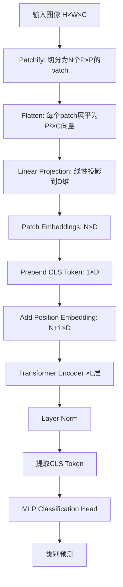

## 前言

毕设项目选择的课题是多模态情感分析，因此需要掌握各种模态的经典方法。Vision Transformer（ViT）作为将Transformer架构引入计算机视觉领域的开山之作，打破了CNN长期以来的统治地位，成为了多模态模型中视觉编码器的主流选择。这里记录下ViT的核心思想及其代码实现。

## 正文

`ViT`，Vision Transformer，由Google团队在2020年提出，旨在解决`CNN`架构的两个固有缺陷：

1. **局部感受野的限制**：CNN通过滑动窗口进行特征提取，天然更关注局部纹理、边缘、角点等特征，对于远距离依赖和全局结构建模能力较弱。虽然可以通过堆叠更多层来扩大感受野，但这带来了沉重的计算负担，且信息在逐层传递中会有损失。

2. **缺乏位置敏感性**：CNN的卷积操作具有平移等变性，这意味着物体在图像中的任何位置都会产生相同的特征响应。虽然这在某些任务中是优点，但在需要理解空间布局的任务中却成为了劣势。

`ViT` 的核心洞察是：**既然Transformer在NLP领域取得了巨大成功，为何不直接将其应用于视觉任务？** 具体做法是将图像切分为固定大小的patch序列，每个patch经过线性投影后作为一个token输入Transformer，从而将二维图像问题转化为一维序列问题。

简单理解就是，`ViT`把图像当作一篇"视觉文章"，每个patch就是一个"单词"，然后用Transformer来"阅读理解"这篇文章。

### ViT的核心公式

**Patch Embedding**：

将图像 $\mathbf{x} \in \mathbb{R}^{H \times W \times C}$ 切分为 $N = \frac{HW}{P^2}$ 个patch，每个patch展平后通过线性投影：

$$\mathbf{z}_0 = [\mathbf{x}_{class}; \mathbf{x}_p^1\mathbf{E}; \mathbf{x}_p^2\mathbf{E}; \cdots; \mathbf{x}_p^N\mathbf{E}] + \mathbf{E}_{pos}$$

其中 $\mathbf{E} \in \mathbb{R}^{(P^2 \cdot C) \times D}$ 为patch投影矩阵，$\mathbf{E}_{pos} \in \mathbb{R}^{(N+1) \times D}$ 为位置编码。

**Multi-Head Self-Attention**：

$$\text{Attention}(Q, K, V) = \text{softmax}\left(\frac{QK^T}{\sqrt{d_k}}\right)V$$

$$\text{MSA}(z) = \text{Concat}(\text{head}_1, ..., \text{head}_h)W^O$$

**Transformer Encoder Block**：

$$\mathbf{z}'_l = \text{MSA}(\text{LN}(\mathbf{z}_{l-1})) + \mathbf{z}_{l-1}$$

$$\mathbf{z}_l = \text{MLP}(\text{LN}(\mathbf{z}'_l)) + \mathbf{z}'_l$$

**分类输出**：

$$\mathbf{y} = \text{LN}(\mathbf{z}_L^0)$$

其中 $\mathbf{z}_L^0$ 是最后一层的 `[CLS]` token。

### ViT的流程


### 代码实现

这里实现一个完整的ViT，并在`CIFAR-10`数据集上与CNN进行对比实验。

**Patch Embedding层**：
```python
class PatchEmbedding(nn.Module):
    """
    将图像切分为patch并进行线性投影
    """
    def __init__(self, img_size=224, patch_size=16, in_channels=3, embed_dim=768):
        super(PatchEmbedding, self).__init__()
        self.img_size = img_size
        self.patch_size = patch_size
        self.num_patches = (img_size // patch_size) ** 2
        
        # 使用卷积实现patch切分和线性投影（等价于切分+全连接）
        self.proj = nn.Conv2d(
            in_channels, 
            embed_dim, 
            kernel_size=patch_size, 
            stride=patch_size
        )
    
    def forward(self, x):
        # x: [B, C, H, W]
        x = self.proj(x)  # [B, embed_dim, H/P, W/P]
        x = x.flatten(2)  # [B, embed_dim, num_patches]
        x = x.transpose(1, 2)  # [B, num_patches, embed_dim]
        return x
```

**Multi-Head Self-Attention**：
```python
class MultiHeadSelfAttention(nn.Module):
    """
    多头自注意力机制
    """
    def __init__(self, embed_dim=768, num_heads=12, dropout=0.0):
        super(MultiHeadSelfAttention, self).__init__()
        self.num_heads = num_heads
        self.head_dim = embed_dim // num_heads
        self.scale = self.head_dim ** -0.5
        
        # QKV投影合并为一个线性层
        self.qkv = nn.Linear(embed_dim, embed_dim * 3)
        self.proj = nn.Linear(embed_dim, embed_dim)
        self.dropout = nn.Dropout(dropout)
    
    def forward(self, x):
        B, N, C = x.shape
        
        # 计算QKV并reshape为多头形式
        qkv = self.qkv(x).reshape(B, N, 3, self.num_heads, self.head_dim)
        qkv = qkv.permute(2, 0, 3, 1, 4)  # [3, B, heads, N, head_dim]
        q, k, v = qkv[0], qkv[1], qkv[2]
        
        # 计算注意力分数
        attn = (q @ k.transpose(-2, -1)) * self.scale  # [B, heads, N, N]
        attn = attn.softmax(dim=-1)
        attn = self.dropout(attn)
        
        # 加权聚合value
        x = (attn @ v).transpose(1, 2).reshape(B, N, C)  # [B, N, C]
        x = self.proj(x)
        
        return x
```

**MLP（Feed-Forward Network）**：
```python
class MLP(nn.Module):
    """
    Transformer中的前馈神经网络
    """
    def __init__(self, embed_dim=768, mlp_ratio=4.0, dropout=0.0):
        super(MLP, self).__init__()
        hidden_dim = int(embed_dim * mlp_ratio)
        
        self.fc1 = nn.Linear(embed_dim, hidden_dim)
        self.act = nn.GELU()
        self.fc2 = nn.Linear(hidden_dim, embed_dim)
        self.dropout = nn.Dropout(dropout)
    
    def forward(self, x):
        x = self.fc1(x)
        x = self.act(x)
        x = self.dropout(x)
        x = self.fc2(x)
        x = self.dropout(x)
        return x
```

**Transformer Encoder Block**：
```python
class TransformerBlock(nn.Module):
    """
    单个Transformer编码器块
    """
    def __init__(self, embed_dim=768, num_heads=12, mlp_ratio=4.0, dropout=0.0):
        super(TransformerBlock, self).__init__()
        
        self.norm1 = nn.LayerNorm(embed_dim)
        self.attn = MultiHeadSelfAttention(embed_dim, num_heads, dropout)
        self.norm2 = nn.LayerNorm(embed_dim)
        self.mlp = MLP(embed_dim, mlp_ratio, dropout)
    
    def forward(self, x):
        # Pre-Norm架构（与原始Transformer的Post-Norm不同）
        x = x + self.attn(self.norm1(x))
        x = x + self.mlp(self.norm2(x))
        return x
```

**完整的ViT模型**：
```python
class VisionTransformer(nn.Module):
    """
    完整的Vision Transformer模型
    """
    def __init__(
        self, 
        img_size=224, 
        patch_size=16, 
        in_channels=3, 
        num_classes=1000,
        embed_dim=768, 
        depth=12, 
        num_heads=12, 
        mlp_ratio=4.0, 
        dropout=0.0
    ):
        super(VisionTransformer, self).__init__()
        
        # Patch Embedding
        self.patch_embed = PatchEmbedding(
            img_size, patch_size, in_channels, embed_dim
        )
        num_patches = self.patch_embed.num_patches
        
        # CLS Token（可学习的分类token）
        self.cls_token = nn.Parameter(torch.zeros(1, 1, embed_dim))
        
        # Position Embedding（可学习的位置编码）
        self.pos_embed = nn.Parameter(torch.zeros(1, num_patches + 1, embed_dim))
        self.pos_dropout = nn.Dropout(dropout)
        
        # Transformer Encoder
        self.blocks = nn.Sequential(*[
            TransformerBlock(embed_dim, num_heads, mlp_ratio, dropout)
            for _ in range(depth)
        ])
        
        # 最终的LayerNorm
        self.norm = nn.LayerNorm(embed_dim)
        
        # 分类头
        self.head = nn.Linear(embed_dim, num_classes)
        
        # 参数初始化
        self._init_weights()
    
    def _init_weights(self):
        # 位置编码使用截断正态分布初始化
        nn.init.trunc_normal_(self.pos_embed, std=0.02)
        nn.init.trunc_normal_(self.cls_token, std=0.02)
        
        # 线性层和LayerNorm初始化
        for m in self.modules():
            if isinstance(m, nn.Linear):
                nn.init.trunc_normal_(m.weight, std=0.02)
                if m.bias is not None:
                    nn.init.zeros_(m.bias)
            elif isinstance(m, nn.LayerNorm):
                nn.init.zeros_(m.bias)
                nn.init.ones_(m.weight)
    
    def forward(self, x):
        B = x.shape[0]
        
        # Patch Embedding
        x = self.patch_embed(x)  # [B, N, D]
        
        # 拼接CLS Token
        cls_tokens = self.cls_token.expand(B, -1, -1)  # [B, 1, D]
        x = torch.cat([cls_tokens, x], dim=1)  # [B, N+1, D]
        
        # 添加位置编码
        x = x + self.pos_embed
        x = self.pos_dropout(x)
        
        # Transformer Encoder
        x = self.blocks(x)
        
        # LayerNorm
        x = self.norm(x)
        
        # 取CLS Token进行分类
        cls_output = x[:, 0]
        
        # 分类头
        logits = self.head(cls_output)
        
        return logits
```

**ViT模型变体工厂函数**：
```python
def vit_tiny(num_classes=1000, img_size=224):
    """ViT-Tiny: 5.7M参数"""
    return VisionTransformer(
        img_size=img_size, patch_size=16, embed_dim=192, 
        depth=12, num_heads=3, num_classes=num_classes
    )

def vit_small(num_classes=1000, img_size=224):
    """ViT-Small: 22M参数"""
    return VisionTransformer(
        img_size=img_size, patch_size=16, embed_dim=384, 
        depth=12, num_heads=6, num_classes=num_classes
    )

def vit_base(num_classes=1000, img_size=224):
    """ViT-Base: 86M参数"""
    return VisionTransformer(
        img_size=img_size, patch_size=16, embed_dim=768, 
        depth=12, num_heads=12, num_classes=num_classes
    )

def vit_large(num_classes=1000, img_size=224):
    """ViT-Large: 307M参数"""
    return VisionTransformer(
        img_size=img_size, patch_size=16, embed_dim=1024, 
        depth=24, num_heads=16, num_classes=num_classes
    )
```

### CIFAR-10对比实验

**简化版CNN基线**：
```python
class SimpleCNN(nn.Module):
    def __init__(self, num_classes=10):
        super(SimpleCNN, self).__init__()
        self.features = nn.Sequential(
            nn.Conv2d(3, 64, kernel_size=3, padding=1),
            nn.BatchNorm2d(64),
            nn.ReLU(),
            nn.MaxPool2d(2),
            
            nn.Conv2d(64, 128, kernel_size=3, padding=1),
            nn.BatchNorm2d(128),
            nn.ReLU(),
            nn.MaxPool2d(2),
            
            nn.Conv2d(128, 256, kernel_size=3, padding=1),
            nn.BatchNorm2d(256),
            nn.ReLU(),
            nn.AdaptiveAvgPool2d(1)
        )
        self.classifier = nn.Linear(256, num_classes)
    
    def forward(self, x):
        x = self.features(x)
        x = x.view(x.size(0), -1)
        x = self.classifier(x)
        return x
```

**简化版ViT（适配CIFAR-10的32×32图像）**：
```python
class ViTForCIFAR(nn.Module):
    """
    针对CIFAR-10优化的小型ViT
    """
    def __init__(self, num_classes=10, img_size=32, patch_size=4, 
                 embed_dim=256, depth=6, num_heads=8):
        super(ViTForCIFAR, self).__init__()
        
        self.patch_embed = PatchEmbedding(
            img_size, patch_size, 3, embed_dim
        )
        num_patches = (img_size // patch_size) ** 2  # 64 patches
        
        self.cls_token = nn.Parameter(torch.zeros(1, 1, embed_dim))
        self.pos_embed = nn.Parameter(torch.zeros(1, num_patches + 1, embed_dim))
        
        self.blocks = nn.Sequential(*[
            TransformerBlock(embed_dim, num_heads, mlp_ratio=4.0, dropout=0.1)
            for _ in range(depth)
        ])
        
        self.norm = nn.LayerNorm(embed_dim)
        self.head = nn.Linear(embed_dim, num_classes)
        
        nn.init.trunc_normal_(self.pos_embed, std=0.02)
        nn.init.trunc_normal_(self.cls_token, std=0.02)
    
    def forward(self, x):
        B = x.shape[0]
        x = self.patch_embed(x)
        
        cls_tokens = self.cls_token.expand(B, -1, -1)
        x = torch.cat([cls_tokens, x], dim=1)
        x = x + self.pos_embed
        
        x = self.blocks(x)
        x = self.norm(x)
        
        return self.head(x[:, 0])
```

**训练与评估**：
```python
def train_and_evaluate(model, train_loader, test_loader, epochs=100, lr=3e-4):
    device = torch.device('cuda' if torch.cuda.is_available() else 'cpu')
    model = model.to(device)
    
    optimizer = torch.optim.AdamW(model.parameters(), lr=lr, weight_decay=0.05)
    scheduler = torch.optim.lr_scheduler.CosineAnnealingLR(optimizer, epochs)
    criterion = nn.CrossEntropyLoss()
    
    for epoch in range(epochs):
        # 训练
        model.train()
        train_loss, train_correct = 0, 0
        for images, labels in train_loader:
            images, labels = images.to(device), labels.to(device)
            
            optimizer.zero_grad()
            outputs = model(images)
            loss = criterion(outputs, labels)
            loss.backward()
            optimizer.step()
            
            train_loss += loss.item()
            train_correct += (outputs.argmax(1) == labels).sum().item()
        
        scheduler.step()
        
        # 评估
        model.eval()
        test_correct = 0
        with torch.no_grad():
            for images, labels in test_loader:
                images, labels = images.to(device), labels.to(device)
                outputs = model(images)
                test_correct += (outputs.argmax(1) == labels).sum().item()
        
        train_acc = train_correct / len(train_loader.dataset)
        test_acc = test_correct / len(test_loader.dataset)
        
        if epoch % 10 == 0:
            print(f"Epoch {epoch}: Train Acc={train_acc:.4f}, Test Acc={test_acc:.4f}")

# 数据加载
transform_train = transforms.Compose([
    transforms.RandomCrop(32, padding=4),
    transforms.RandomHorizontalFlip(),
    transforms.ToTensor(),
    transforms.Normalize((0.4914, 0.4822, 0.4465), (0.2470, 0.2435, 0.2616))
])

transform_test = transforms.Compose([
    transforms.ToTensor(),
    transforms.Normalize((0.4914, 0.4822, 0.4465), (0.2470, 0.2435, 0.2616))
])

train_dataset = torchvision.datasets.CIFAR10(
    root='./data', train=True, transform=transform_train, download=True
)
test_dataset = torchvision.datasets.CIFAR10(
    root='./data', train=False, transform=transform_test, download=True
)

train_loader = DataLoader(train_dataset, batch_size=128, shuffle=True, num_workers=4)
test_loader = DataLoader(test_dataset, batch_size=128, shuffle=False, num_workers=4)

# 训练对比
print("Training CNN...")
cnn_model = SimpleCNN(num_classes=10)
train_and_evaluate(cnn_model, train_loader, test_loader)

print("\nTraining ViT...")
vit_model = ViTForCIFAR(num_classes=10)
train_and_evaluate(vit_model, train_loader, test_loader)
```

### ViT与CNN的对比

| 特性 | CNN | ViT |
|------|-----|-----|
| 感受野 | 局部→逐层扩大 | 全局（每层都是全图） |
| 归纳偏置 | 强（局部性、平移等变性） | 弱（几乎从数据学习一切） |
| 位置信息 | 隐式（通过空间结构） | 显式（位置编码） |
| 计算复杂度 | O(HWC²k²) | O((HW/P²)²D) |
| 小数据表现 | 较好（归纳偏置有帮助） | 较差（需要大量数据） |
| 大数据表现 | 趋于饱和 | 持续提升 |
| 可解释性 | 特征图可视化 | 注意力图可视化 |

### ViT的注意力可视化
```python
def visualize_attention(model, image, patch_size=16):
    """
    可视化ViT的注意力权重
    """
    model.eval()
    
    # 获取注意力权重（需要修改模型以返回注意力）
    with torch.no_grad():
        # 假设model.get_attention_maps()返回所有层的注意力
        attention_maps = model.get_attention_maps(image.unsqueeze(0))
    
    # 取最后一层，对所有头取平均
    attn = attention_maps[-1].mean(dim=1)  # [1, N+1, N+1]
    
    # 提取CLS token对所有patch的注意力
    cls_attn = attn[0, 0, 1:]  # [N]
    
    # Reshape为二维
    num_patches = int(cls_attn.shape[0] ** 0.5)
    cls_attn = cls_attn.reshape(num_patches, num_patches)
    
    # 上采样到原图大小
    cls_attn = F.interpolate(
        cls_attn.unsqueeze(0).unsqueeze(0),
        size=(image.shape[1], image.shape[2]),
        mode='bilinear'
    ).squeeze()
    
    # 可视化
    plt.figure(figsize=(10, 5))
    plt.subplot(1, 2, 1)
    plt.imshow(image.permute(1, 2, 0))
    plt.title('Original Image')
    
    plt.subplot(1, 2, 2)
    plt.imshow(image.permute(1, 2, 0))
    plt.imshow(cls_attn.numpy(), alpha=0.6, cmap='jet')
    plt.title('Attention Map')
    plt.show()
```

### 小结

ViT的成功揭示了几个深刻的洞察：

1. **归纳偏置并非必需**：在足够多的数据下，模型可以从数据本身学习到CNN中硬编码的那些归纳偏置。
2. **架构统一的价值**：使用相同的Transformer架构处理文本和图像，为多模态学习铺平了道路。
3. **Scale is all you need**：ViT的性能随着模型规模和数据规模的增加而持续提升，展现出强大的scaling law。

然而，ViT也并非完美：它对小数据集表现不佳，计算开销大于同等性能的CNN，且对图像分辨率的变化敏感。这些问题催生了后续一系列改进工作，如DeiT（数据高效训练）、Swin Transformer（层级结构+局部注意力）、MAE（自监督预训练）等。

在多模态领域，ViT已成为视觉编码器的事实标准，从CLIP到LLaVA，从Stable Diffusion到GPT-4V，ViT都扮演着不可或缺的角色。

## 参考文献

1. Dosovitskiy A, et al. "An Image is Worth 16x16 Words: Transformers for Image Recognition at Scale." ICLR, 2021.
2. Touvron H, et al. "Training data-efficient image transformers & distillation through attention." ICML, 2021.
3. Liu Z, et al. "Swin Transformer: Hierarchical Vision Transformer using Shifted Windows." ICCV, 2021.
4. He K, et al. "Masked Autoencoders Are Scalable Vision Learners." CVPR, 2022.
